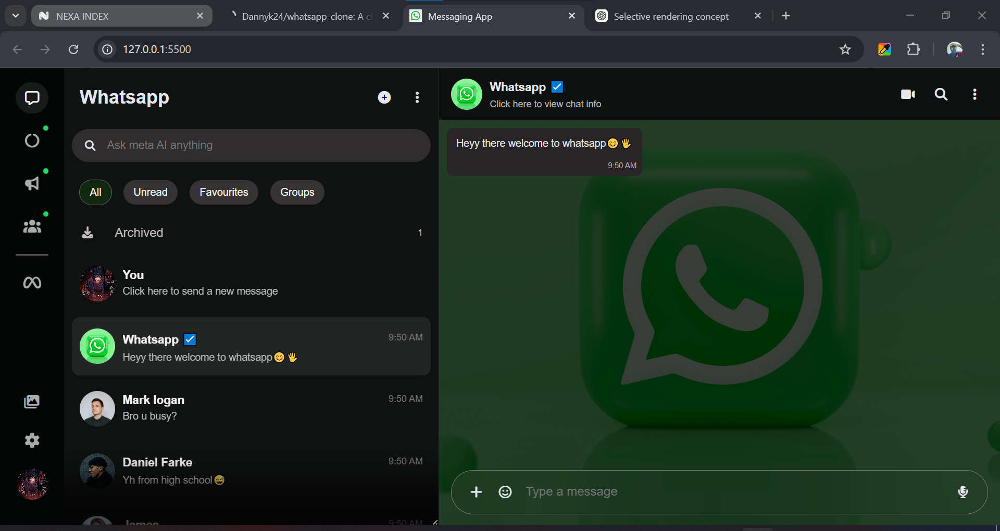

# 💬 WhatsApp Web Chat UI Clone

A simple remake of the WhatsApp Web chat interface focused on the messaging system.

This project simulates sending and receiving messages, including timestamps and message states (sent, delivered, read), using local storage for persistence.

---

## 🚀 Features

- Send and display messages in real-time
- Message timestamps
- Message status indicators (sent, delivered, read)
- Data stored in browser using Local Storage
- Clean chat UI inspired by WhatsApp Web

---

## 🛠️ Built With

- HTML
- CSS
- JavaScript
- Font Awesome (for icons)

---

## 💾 How It Works

- Messages are stored in the browser using **localStorage**
- When a message is sent:
  - It is saved to localStorage
  - The UI updates instantly without reloading the page
- Message states (e.g. read/unread) are also tracked and updated dynamically

---

## 📂 Project Structure
--DATA
--FONTAWESOME
--IMAGES
--UTILS
index.html
styles.css
script.js

## ⚡ Performance Note

While building this project, I initially updated the entire chat list every time a single message state changed (e.g. when a message was marked as read).  

This caused unnecessary re-rendering and performance issues.

To fix this, I switched to a **selective rendering approach**, where only the affected chat/message is updated instead of the whole list.

This improved performance and made the UI updates more efficient.


---

## ▶️ Getting Started

1. Clone the repository:
   ```bash
   git clone https://github.com/Dannyk24/whatsapp-clone.git


📌 Notes
This is a frontend-only project (no backend)
Data will reset if localStorage is cleared
Designed for learning and practice purposes



